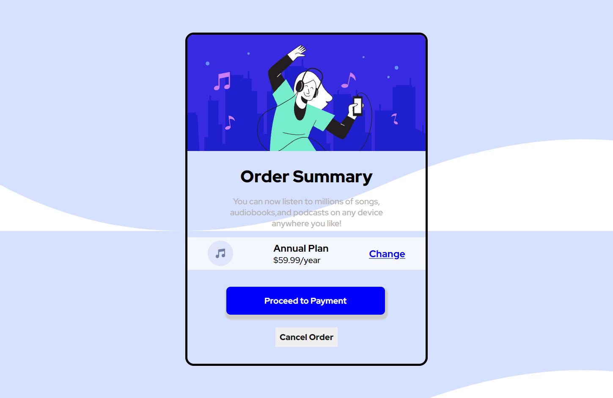

# Frontend Mentor - Order summary card solution

This is a solution to the [Order summary card challenge on Frontend Mentor](https://www.frontendmentor.io/challenges/order-summary-component-QlPmajDUj). Frontend Mentor challenges help you improve your coding skills by building realistic projects. 

## Table of contents

- [Overview](#overview)
  - [The challenge](#the-challenge)
  - [Screenshot](#screenshot)
  - [Links](#links)
- [My process](#my-process)
  - [Built with](#built-with)
  - [What I learned](#what-i-learned)
 - [Author](#author)


## Overview
 i made the project using css flexbox to practice it but faced some problems like when i added flex to buttons container it occupied the whole width of container and then i had to set it using /*position:relative*/ and also i am not able to set the background in the desired way.  

### The challenge

Users should be able to:

- See hover states for interactive elements

### Screenshot


this is the screenshot my first project on frontend mentor..

### Links

- Solution URL: [Add solution URL here](https://your-solution-url.com)
- Live Site URL: [Add live site URL here](https://your-live-site-url.com)

## My process
  first i added the html file and wrote the code and then i added css to style.
### Built with

- Semantic HTML5 markup
- CSS custom properties
- Flexbox
- Desktop-first workflow

### What I learned

i learnt to use flexbox and a new font-family.


```css
.container-2{
    background: hsl(225, 100%, 98%);

    display: flex;
    align-items: center;
    justify-content: space-around;
    margin-bottom: 32px;
    *{
    box-sizing: border-box;
    font-family:  'Red Hat Display', sans-serif;
}


```


  


### Useful resources

- [Example resource 1](https://www.ezyzip.com
) - This helped me to unzip my files. I really liked this website and will use it going forward.
- [CSS tricks](
https://css-tricks.com ) - This is an amazing article which helped me finally understand svg as backgrounds. I'd recommend it to anyone learning this concept.


## Author
- Twitter - [@ManasMG24](https://www.twitter.com/@ManasMG24)


